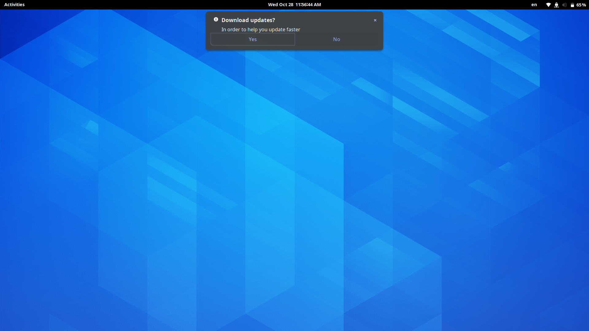

# auto-update-downloader
Automatically downloads updates, so you can update faster!


## Installation
Simply run this in the terminal!

```bash
bash <(curl -s https://raw.githubusercontent.com/daniel071/auto-update-downloader/master/install.sh)
```

## Uninstallation
1. Edit `~/.profile` and remote the added line that runs main.sh
2. Delete the `~/.auto-update-downloader` folder
